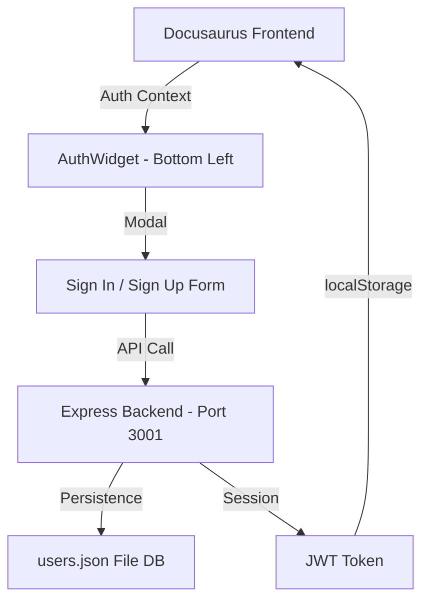

# Authentication System (Auth-Text)

A full-featured, secure, and personalized authentication system has been integrated into the Physical AI Textbook.

## Features

- **Bottom-Left Floating UI**: A non-intrusive "Account" widget located at the bottom-left corner of the screen.
- **Full Flow Support**:
  - **Sign In**: Secure login with JWT tokens.
  - **Registration (Sign Up)**: New user creation with encrypted password storage.
  - **Forgot Password**: Password recovery simulation (demo mode).
- **Glassmorphic Design**: Modern transparent UI with background-blur, matching the "Physical AI" futuristic aesthetic.
- **Deep Personalization**:
  - Authenticated users are greeted by name in the Chatbot.
  - AI responses are personalized based on the logged-in user's identity.
- **Secure Backend**: Multi-layered security using `bcryptjs` for hashing and `jsonwebtoken` for session management.
- **Responsive**: Fully optimized for mobile and desktop screens.

## Architecture

## How to Use

### 1. Registration
- Click the **Account** button at the bottom-left.
- Select **Create an account**.
- Fill in your details and click **Register Now**.

### 2. Signing In
- Enter your registered email and password.
- Upon success, the widget will transform into a **User Profile** bubble.

### 3. AI Personalization
- Open the Chatbot (bottom-right).
- The AI will automatically recognize you: *"Welcome back, [Name]!"*
- Ask any question, and the backend will process it as your identified session.

## Configuration

- **Backend Location**: `backend/server.js`
- **Frontend Components**: `src/components/AuthUI`
- **State Management**: `src/context/AuthContext.tsx`
- **Database**: `backend/users.json` (initialized automatically)

## Security Best Practices Implemented
1. **Password Hashing**: Never stored in plain text.
2. **JWT Stateless Auth**: Secure transmission of identity.
3. **CORS Protected**: Only allows authorized origins.
4. **Input Sanitization**: Basic validation on all forms.
